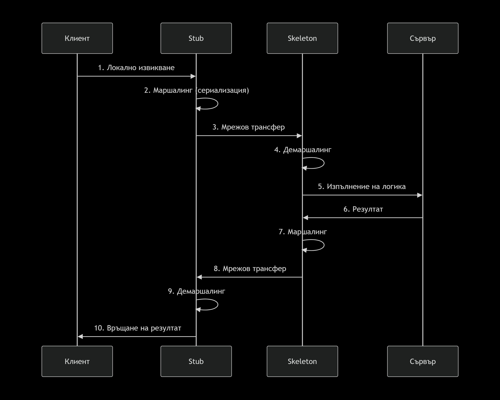

# ПИСС

## Характеристики на разпределените софтуерни системи – дефиниции, видове системи и тенденции

## Междупроцесна комуникация – отдалечено извикване, мултикаст

В една разпределена софтуерна система участват **възли** (физически/виртуални машини) с хетерогенен хардуер, върху които се изпълняват процеси от даден софтуерен **компонент**. Самите компоненти могат да бъдат реализирани на всевъзможни езици за програмиране (хетерогенност). Компонентите взаимодействат помежду си, като излагат процедури за отдалечено извикване от други компоненти. Затова са необходими механизми за осъществяване на прозрачна комуникация между тях.

Операционните системи предоставят механизми на ниско ниво за **IPC (Inter-Process Communication)**, които включват *опашки от съобщения (message queues)*, *семафори* и *споделена памет (shared memory)*. Използването им директно обаче оставя цялата синхронизация, управление на нишки и мрежови съображения на ниско ниво изцяло в ръцете на програмиста.

За избягване на тази сложност се използва **Middleware (междинен софтуер)**. Това е софтуерен слой, който предоставя подходящи унифицирани интерфейси, така че компонентите да си взаимодействат, скривайки детайлите на мрежата и операционната система (**прозрачност на местоположението**).

Чрез Middleware компонентите извикват отдалечени процедури по следния динамичен модел:

1. **Контракт и код на сървъра:** Един компонент (сървър/доставчик), който предоставя услуга, първо дефинира нейния интерфейс на **IDL (Interface Definition Language)**. След това компилаторът на Middleware превежда интерфейса от IDL към езика на сървъра (напр. C++), генерирайки име, параметри и тип на връщане на функцията. Middleware изгражда т.нар. **Skeleton (сървърен скелет)** за услугата, а програмистът попълва реалната бизнес логика на C++.
2. **Локално прокси на клиента:** Middleware предоставя интерфейса на услугата на други компоненти (клиенти/ползватели), като автоматично генерира за тях локално прокси, наречено **Stub (заглушка)**, на техния език (напр. Java). Клиентският компонент вижда този Stub като локален обект/namespace и може да извика услугата по напълно **прозрачен** за себе си начин.
3. **Маршалинг:** При извикване на услугата от клиента, Stub-ът улавя извикването, взема подадените параметри и ги пакетира в неутрален байтов формат по мрежата (**маршалинг / сериализация**) към Skeleton-а на сървъра.
4. **Изпълнение и отговор:** Skeleton-ът получава пакета, разопакова го (**демаршалинг / десериализация**) и извиква същинската процедура на оригиналния език на сървъра (C++). След като тя приключи, Skeleton-ът взема резултата, маршализира го и го връща обратно по мрежата към Stub-а.
5. **Получаване на резултата:** Stub-ът демаршализира получения резултат и го връща на извикващия клиент като стандартна променлива на Java.

Този общ модел се реализира от процедурно-ориентираната архитектура **RPC (Remote Procedure Call)**, както и от нейния обектно-ориентиран аналог **RMI (Remote Method Invocation)**, специфичен за езика Java. При RMI компонентите са обекти, които запазват напълно свойствата и парадигмата на обектно-ориентираното програмиране (ООП).

RPC дефинира следните **семантики за извикване** на отдалечена процедура при възникване на мрежови грешки:

* **Maybe (Възможно е):** Процедурата се извиква един път или въобще не се извиква, като извикващият не получава потвърждение за изпълнение. Това е най-ненадеждната семантика (използва се при стрийминг).
* **At-least-once (Поне веднъж):** Клиентът повтаря заявката до успешно получаване на резултат. Съществува риск от дублиране и многократно изпълнение на операцията на сървъра, ако отговорите се губят в мрежата.
* **At-most-once (Най-много веднъж):** Гарантира, че процедурата ще се изпълни най-много веднъж. Сървърът разпознава дублираните заявки по уникални идентификатори и не ги преизчислява, което елиминира риска от странични ефекти.
* **Exactly-once (Точно веднъж):** Процедурата се изпълнява точно веднъж. Това е идеалната и най-надеждна семантика, но на практика изисква сложни транзакционни протоколи и идемпотентност.

При Java RMI се използва **RMI Registry**. То действа като централизирана директорийна услуга (телефонен указател), където доставчиците публикуват своите Stub-ове под текстови имена, а клиентите ги търсят и изтеглят локално. Това е изключително удобно, защото свалените Stub-ове се държат като native Java обекти в паметта на клиента. Също така, за разлика от RPC, RMI процедурите могат да приемат или връщат цели работещие обекти **по стойност** (чрез сериализация) или **по референция** (чрез изпращане на нов Stub).

**Мултикастът (Multicast)** е метод за оптимизирано групово известяване, при който един компонент изпраща едно съобщение до множество дефинирани получатели едновременно. Логическата мрежова топология между компонентите се оформя като **дърво (Tree)** за директен достъп по най-краткия път или като **пълна мрежа (Mesh)** с алтернативни пътища за по-висока отказоустойчивост.

Рутирането в тези децентрализирани мрежи често използва **епидемични алгоритми (Gossip-Based)**. Пренасянето на съобщението се оприличава на разпространението на биологичен вирус: всеки възел, приел съобщението („заразен“), автономно пробва да го предаде на своите съседи. Информацията се разпространява експоненциално бързо. Моделът е силно устойчив на откази – ако някой възел отпадне, съобщението стига до целта по алтернативни връзки.

Основно предизвикателство при епидемичния мултикаст е **изтриването на информация**. Тъй като няма централен сървър, ако просто изтрием данните от един възел, неговите съседи ще му ги пратят отново при следващия си разговор. Затова се симулира „изтриване чрез модификация“ – разпространява се т.нар. **„сертификат за смърт“ (death certificate)**, който указва на всички компоненти в мрежата да игнорират и отхвърлят даденото съобщение в бъдеще.
